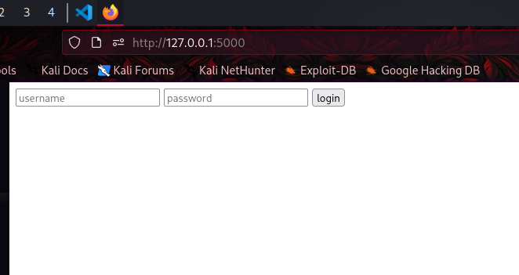
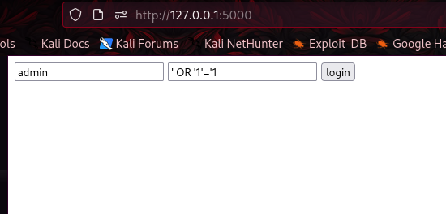
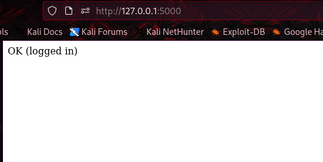
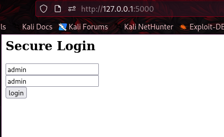
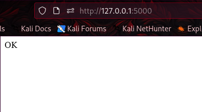
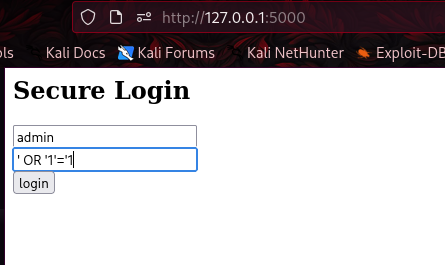
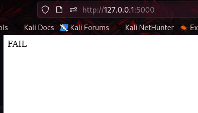

<!-- ===================== -->
<!-- 💜 UNICORN PENTEST UI -->
<!-- ===================== -->


<p align="center">
  
</p>

---

```bash
[ SYSTEM ] unicornOS pentest module v1.0
[ INIT   ] Booting vulnerable environment...
[ LOAD   ] modules: flask, sqlite, auth
[ STATUS ] READY
```

> unicorn-rm

$ role --current
> Cybersecurity Student

$ lab --start
> vulnerable login system loaded
```bash
⚙️ RUN PROJECT
pip install -r requirements.txt
python app.py
> open http://127.0.0.1:5000
> waiting for input...

📸 DEMO
🔐 Login Page
✔ Normal Login
💀 SQL Injection Attack
```


```bash
🧪 ATTACK WALKTHROUGH
[ STEP 1 ] normal login
username: admin
password: admin
> ✔ ACCESS GRANTED
[ STEP 2 ] wrong password
username: admin
password: 123
> ❌ ACCESS DENIED
[ STEP 3 ] SQL injection 💀
username: admin
password: ' OR '1'='1
```


```bash
📜 ATTACK LOG
[LOG] admin/admin        → SUCCESS
[LOG] admin/123          → FAIL
[LOG] admin/' OR '1'='1  → SUCCESS 💀

🛡️ FIX (SECURE MODE)
cursor.execute(
    "SELECT * FROM users WHERE username=? AND password=?",
    (user, password)
)
[ STATUS ] injection blocked ✔
```


```bash
🧬 SKILLS USED
> SQL Injection
> Flask
> SQLite
> Web Security
> Vulnerability Analysis
> Secure Coding
```

## 🎬 Live Demo ATTACK

### 1️⃣ Login Page
<p align="center">
  
</p>

---

### 2️⃣ Injection Attack
<p align="center">
  
</p>

---

### 3️⃣ Access Granted
<p align="center">
  
</p>


## 🎬 Live Demo Secure

### 1️⃣ Login Page
<p align="center">
  
</p>

---

### 2️⃣ Secure
<p align="center">
  
</p>

---

### 3️⃣ Attack
<p align="center">
  
</p>

---

### 3️⃣ SQL Secure
<p align="center">
  
</p>

📦 Installation

```bash
git clone https://github.com/unicorn-rm/vuln-login.git
cd vuln-login

python3 -m venv venv
source venv/bin/activate   # Linux/Mac
# venv\Scripts\activate    # Windows

pip install -r requirements.txt
▶️ Run application
python3 app.py
🌐 Default access
http://127.0.0.1:5000
```
========================================
[ SYSTEM BREAK ]
========================================

