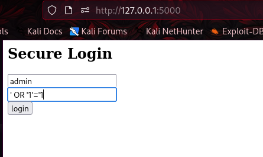
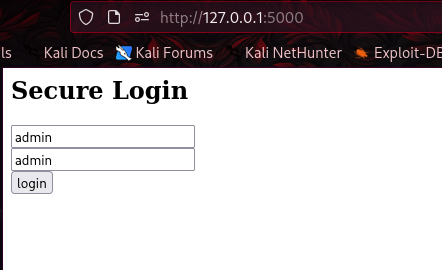

# vuln-login

Учебный стенд по веб-пентесту: форма входа с намеренной SQL-инъекцией и рядом,
в той же папке, исправленная версия. Видно и саму атаку, и то, чем она лечится.

> [!WARNING]
> В `app.py` **намеренно оставлена уязвимость**. Это стенд для практики.
> Не разворачивайте его в интернете и не используйте этот код как основу
> рабочего приложения. Оба приложения привязаны к `127.0.0.1` и запускаются
> без отладочного режима.

## Уязвимость

Запрос собирается склейкой строк, поэтому ввод пользователя попадает прямо
в SQL:

```python
query = f"SELECT * FROM users WHERE username = '{user}' AND password = '{password}'"
```

Ввод `' OR '1'='1` в поле пароля закрывает кавычку и дописывает всегда истинное
условие. Запрос превращается в `... AND password = '' OR '1'='1'` и возвращает
первую строку таблицы — вход выполнен без пароля.



## Как чинится

Параметризованный запрос. Значения передаются отдельно от текста запроса,
драйвер экранирует их сам, и ввод уже не может изменить структуру SQL:

```python
query = "SELECT * FROM users WHERE username = ? AND password = ?"
cursor.execute(query, (username, password))
```



## Как запустить

```bash
pip install flask

python app.py           # уязвимая версия  → http://127.0.0.1:5000
python secure/app.py    # исправленная     → http://127.0.0.1:5001
```

## Разбор

| Шаг | Ввод | Уязвимая | Исправленная |
|---|---|---|---|
| Обычный вход | `admin` / `admin` | вход | вход |
| Неверный пароль | `admin` / `123` | отказ | отказ |
| Инъекция | `admin` / `' OR '1'='1` | **вход без пароля** | отказ |

## Граница стенда

Стенд закрывает **ровно одну** вещь — инъекцию. Пароли в нём и хранятся, и
сравниваются в открытом виде: так нагляднее видно разницу между двумя запросами,
но в рабочем приложении так делать нельзя. Хранить нужно хеш с солью
(`werkzeug.security`, `bcrypt`, `argon2`), а сравнивать — функцией проверки хеша.
Это отдельная тема и отдельный стенд.

## Лицензия

MIT — см. [LICENSE](LICENSE).
